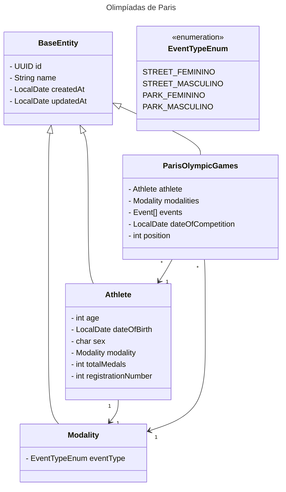

## Olimpíadas de Paris 🗼

 

> API desenvolvida para resolução do desafio "Publicando Sua API REST na Nuvem Usando Spring Boot 3, Java 17 e Railway" da Digital Innovation One.

 

#### Tendo em vista a chegada dos Jogos Olímpicos de Paris, nada melhor do que acompanharmos e deixarmos registrado a participação dos nossos atletas nesse evento super importante. Pensando nisso, essa API foi idealizada para obtermos um histórico da participação dos nossos atletas brasileiros nas Olimpíadas.

#### O objetivo é ter todas as modalidades e atletas que participaram das Olimpíadas de Paris registrados nessa API e tornar a API pública . Essa aplicação vai disponibilizar informações como:

 

##### 🏄‍ Atleta 
 * nome;
 * idade;
 * data de nascimento;
 * modalidade;
 * evento;
 * total de medalhas.

##### ✨ Jogos 
 * posição na tabela / modalidade e evento;

 

### 💡 Diagrama de Classes

 

> [**Referências**]
> 
> Dados dos atletas, modalidades, ranking [Site das olimpíadas](https://olympics.com/pt/atletas/)  
> Lista dos atletas por modalidade [Portal Terra](https://www.terra.com.br/esportes/jogos-olimpicos/brasil-nos-jogos-olimpicos-2024-datas-horarios-e-modalidades,f11296b3b5a5aaa562680dff90d8d8fehbsr55zq.html#:~:text=Atletas%20e%20modalidades%20em%20que,estar%C3%A1%20presente%20em%2039%20modalidades.)
